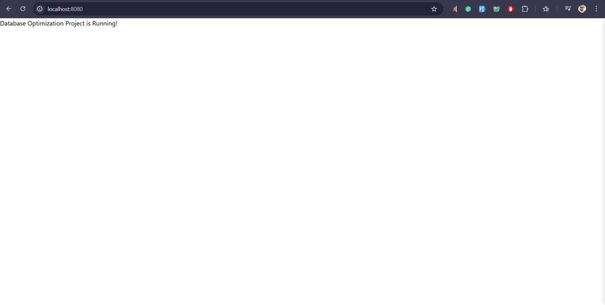

# Database Optimization Project

## Project Description

This project aims to optimize database performance for the **Bank Marketing** dataset using **PostgreSQL** and **Node.js**. 
 - The focus is on improving the efficiency of database queries through **stored procedures**, **triggers**, and **indexes**. 
 - Additionally, a backend API is developed using **Node.js** and **Express.js** for interacting with the database. API documentation is provided using **Swagger**.

## Features

- **PostgreSQL Database Optimization**: Schema design, indexing, and query optimizations.
- **Backend API Development**: A RESTful API to perform CRUD operations on the dataset.
- **Swagger Documentation**: Interactive API documentation for easy testing.
- **Stored Procedures and Triggers**: Optimized queries and automated updates.

## Solution Overview

The solution includes:
- A well-designed database schema for the Bank Marketing dataset.
- Optimized database queries with stored procedures and triggers.
- A Node.js backend with CRUD APIs for client and campaign data.
- Swagger UI for interactive API documentation.

## Project Setup

### Prerequisites

- Node.js (version 16.x or higher)
- PostgreSQL (version 13.x or higher)
- Swagger UI for API documentation


---

### > **Solution Images screenshots**

```markdown

