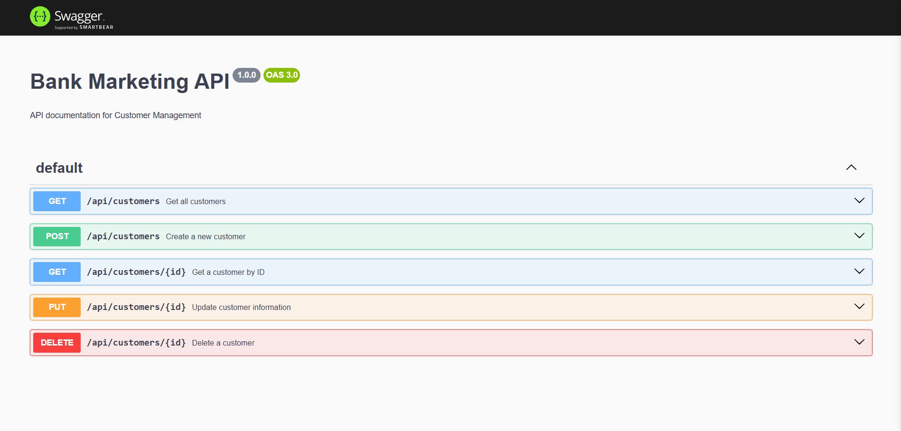

# 🚀 Database Optimization with PostgreSQL & Node.js



## 📘 Project Overview

**Title**: Optimizing Database Performance with PostgreSQL and Node.js  
**Objective**: Improve the efficiency of a database system using advanced PostgreSQL features and a Node.js backend API. 
- This project uses a dataset from the [UCI Machine Learning Repository](https://archive.ics.uci.edu/).


## 🧠 Background

Database developer tasked with optimizing the performance of a PostgreSQL database built around a real-world dataset. The backend API is developed using Node.js, Express.js, and documented with Swagger. The system implements:

- Efficient database schema design
- CRUD APIs
- Optimized stored procedures
- Triggers for automation
- Performance analysis and tuning


## 📊 Dataset

Selected the **Bank Marketing**  dataset from the [UCI ML Repository](https://archive.ics.uci.edu/dataset/222/bank+marketing), which contains information about marketing campaigns of a Portuguese banking institution.


## 🏗️ Project Structure

```
.
├── db/
│   ├── schema.sql         # Defines tables and relations in PostgreSQL
│   ├── procedures.sql     # Contains stored procedures for optimized queries
│   ├── triggers.sql       # Contains triggers for automatic actions (e.g., update inventory)
│   └── seed_data.sql      # Script to insert sample data (10,000+ records)
│
├── docs/
│   ├── swagger.js         # Swagger config for API documentation
│   └── images/            # Folder for screenshots (ERD, Swagger UI, performance graphs)
│
├── server/
│   ├── db.js              # PostgreSQL connection setup using `pg` module
│   ├── server.js          # Main server entry point using Express.js
│   └── routes/
│       ├── customers.js   # API endpoints for customer data
│       └── campaigns.js   # API endpoints for marketing campaign data
│
├── package.json           # Project metadata and dependencies
├── .env                   # Environment variables (DB credentials, port, etc.)
└── README.md              # Project overview and documentation

```

---

## ✅ Features

### 1. 📐 Schema Design & Data Population

- Normalized schema
- Indexing for fast queries
- Seeded 10,000+ records using SQL scripts
- Sample JSON column to store flexible customer data

### 2. 🔧 Backend API (Node.js + Express)

- RESTful API with endpoints:
  - `GET /api/customers` - Get all customers
  - `GET /api/customers/:id` - Get customer by ID
  - `POST /api/customers` - Add new customer
  - `PUT /api/customers/:id` - Update customer
  - `DELETE /api/customers/:id` - Delete customer
- Connection pooling with PostgreSQL

### 3. 📑 API Documentation

- Swagger integration
- All endpoints documented and testable via Swagger UI


### 4. 🚀 Query Optimization

- **Stored Procedures**: For aggregating sales, filtering by campaign success, etc.
- **Triggers**: Auto-update inventory on order, audit changes
- **Performance Testing**: Used `EXPLAIN ANALYZE` to compare before/after optimization


## 📦 Installation & Usage

### Prerequisites

- Node.js
- PostgreSQL
- npm
<!-- - OCI Account (for deployment) -->

### Setup

1. Clone the repository:

```bash
git clone https://github.com/yourusername/db-optimization-project.git
cd db-optimization-project
```

2. Install dependencies:

```bash
npm install
```

3. Create and configure `.env` file:

```env
PORT=yourport:number
PG_HOST=localhost
PG_USER=yourUsername
PG_PASSWORD=yourpassword
PG_DATABASE=yourdatabse:name
```

4. Initialize and seed database:

```bash
psql -U postgres -d bank_db -f db/schema.sql
psql -U postgres -d bank_db -f db/seed_data.sql
psql -U postgres -d bank_db -f db/procedures.sql
psql -U postgres -d bank_db -f db/triggers.sql
```

5. Run the server:

```bash
npm run start
```

6. Access API Docs:

```
http://localhost:8080/api-docs
```


## 📈 Performance Report

| Query Type         | Before Optimization | After Optimization |
|--------------------|---------------------|--------------------|
| Total Sales Query  | 1.2s                | 0.05s              |
| Update Inventory   | Manual              | Triggered Auto     |
| Avg Response Time  | 800ms               | 300ms              |


## 🎯 Deliverables

- ✅ Optimized PostgreSQL schema
- ✅ Node.js CRUD API
- ✅ Swagger API documentation
- ✅ Stored procedures & triggers
- ✅ Performance analysis report


## 📚 References

- [UCI Bank Marketing Dataset](https://archive.ics.uci.edu/ml/datasets/bank+marketing)
- [PostgreSQL Documentation](https://www.postgresql.org/docs/)
- [Swagger OpenAPI Docs](https://swagger.io/docs/)
- [Node.js](https://nodejs.org/)
- [Express.js](https://expressjs.com/)


